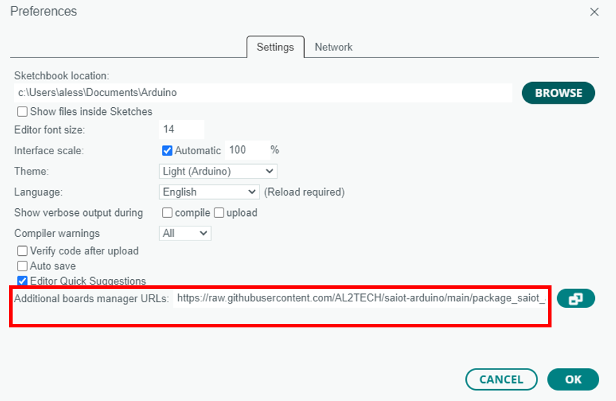
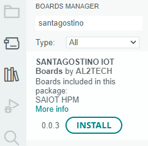
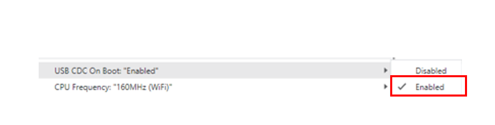
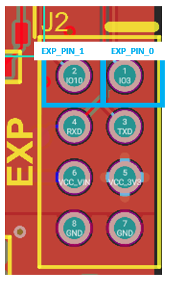

# saiot-arduino
Arduino board-package targeting Sant'Agostino IoT devices.

# Changelog
* v0.0.4: first official stable-release.

# Prerequisites
* Sant'Agostino IoT Boards.
* Arduino 2.X IDE.
# Installation
1. Open the Arduino 2.X IDE.
2. Open the menu File->Preferences.
3. Copy the following link in "Additional boards manager URLs": https://raw.githubusercontent.com/AL2TECH/saiot-arduino/main/package_saiot_arduino_index.json.

4. Open the Boards Manager: Tools->Board->Board Manager.
5. Search for "santagostino" board package and install the latest available version.

6. If installation has been successful, a new board package selection (i.e., SANTAGOSTINO IOT Boards) and a list of related boards (e.g., HPM (Heat Pump Monitor)) should appear under Tools->Board. Choose the proper target board when developing.

# Board setup/configuration
1. When the board is powered up for the first time or when it has been flashed with low power mode enabled (details following on a dedicated section), the board must be forced into boot mode following the procedure below: 
    1. Press and hold both reset and user button.

    

    2. Release the reset button.
    3. Release the user button.
    4. Now the boards should appear as a COM device.
2. Under Tools->"USB CDC On Boot" must always be set to Enabled: it redirects serial communication to the USB interface.

3. Choose the assigned COM port under Tools->Port.

# API Documentation: SAIOT_Board class
* This section describes the available methods and public variables exposed by the SAIOT_Board class.
* The class is in charge of handling the board low-level functions (dealing with HW peripherals, scheduler, etc..).
## Public variables
## board_status_t status
Public variable holding the last available board status:
* BOARD_STATUS_OK: no error.
* BOARD_STATUS_WIFI_ERROR: error during wifi connection.
* BOARD_STATUS_NTP_ERROR: error while getting time using NTP.

## bool lowPowerEnable
Public variable for setting low power mode. Default: false.
When lowPowerEnable is true the low power mode is enabled: when no task is in execution the board enters in deep sleep (i.e., the lowest power consumption mode available).
Otherwise when no task is in execution a simple delay is called.
## long wifiConnTimeout
The maximum timeout in seconds used to attempt a wifi connection (could be shorter if the wifi network with a specific ssid, assigned with the begin method, is not present). Default: 10 seconds.
## SAIOT_MQTT* mqtt
Pointer to a SAIOT_MQTT globally initialized class object.
## SAIOT_LED* led
Pointer to a SAIOT_LED globally initialized class object.
## SAIOT_BUTTON* button
Pointer to a SAIOT_BUTTON globally initialized class object.
## SAIOT_LSM6DSOX* imu
Pointer to a SAIOT_LSM6DSOX globally initialized class object.
## SAIOT_Expansion* expansion
Pointer to a SAIOT_Expansion globally initialized class object.
## Methods
## board_status_t begin(ssid, pwd, time_offset_sec)
Initializes the board by setting wifi ssid, wifi password, testing the connection and setting the correct time using NTP (Network Time Protocol-Unix Epoch: seconds elapsed since 00:00:00 UTC). The time offset will be added to the UTC epoch timestamp and can be used for synchronizing with the Local Time Zone.
### Parameters
* const char* ssid: string containing the wifi ssid name.
* const char* pwd: string containing the wifi password.
* const long time_offset_sec: the local time offset in seconds to add to the timestamp retrieved by NTP.
### Returns
* BOARD_STATUS_OK: success.
* BOARD_STATUS_WIFI_ERROR: error during wifi connection.
* BOARD_STATUS_NTP_ERROR: error while getting time using NTP.

## void addTasks(tasks, num_tasks)
Add an array of tasks. The max number of tasks supported is 10.
### Parameters
* SAIOT_Task tasks[] tasks: array of tasks, the maximum supported number of task is 10.
* const uint8_t num_tasks: the tasks array size, must be less or equal than 10.
## bool wifiConnect()
Try to Connect to wifi. It uses wifiConnTimeout as timeout to attempt wifi connection.
### Returns
* true: connection success.
* false: connection failed.
## bool wifiDisconnect()
Disconnects to wifi.
### Returns
* true: disconnection success.
* false: disconnection failed.
## bool isWifiConnected()
Check wifi connection.
### Returns
* true: wifi is connected.
* false: wifi is not connected.
## bool getTimeEpochFormat()
Get the number of seconds since Unix epoch.
### Returns
* uint32_t: number of seconds since Unix epoch.
## loop()
Handles tasks execution and deep sleep/delay. This should be called as final statement inside Arduino void loop().
# API Documentation: SAIOT_Task class
* This section describes the main available methods in SAIOT_Task class.
* This class is designed to initialize all the parameters for a periodic task in an easy fashion.
## Methods
## SAIOT_Task(task_id, interval_time,callback, [offset_time=0], [task_enabled=true])
Creates a task instance.
### Parameters
* const uint8_t task_id: it ranges [0,9] (max 10 tasks handled). Indicates also priority (lower the value higher the priority), between two tasks that need to run at the same time the one with lower task_id takes precedence.
* const uint32_t interval_time: task repetition period in seconds.
* task_callback callback: the callback containing the task job (i.e., void callback(SAIOT_Task* task)).
* const uint32_t offset_time (optional): an offset time in seconds for delayed execution.
* const bool task_enabled (optional): user for enabling or disabling the task execution.

# API Documentation: SAIOT_MQTT class
* This section describes the available methods in SAIOT_MQTT class.
* This class handles mqtt related operations.
## Methods
## bool connect(client_id, username, pwd, server, port)
Connects to a mqtt server, providing client_id, username, password, server address and server port.
### Parameters
* const char* client_id: string containing the client ID.
* const char* username: string containing the client username.
* const char* pwd: string containing the client password.
* const char* server: string containing the server address (the server url).
* const int port: the server port number.
### Returns
* true: connection success.
* false: connection failed.
 ## void disconnect()
 Disconnects from mqtt server.
 ### Returns
* true: disconnection success.
* false: disconnection failed.
## bool isConnected()
Checks mqtt connection.
### Returns
* true: mqtt server is connected.
* false: mqtt server is not connected.
##  bool publish(topic, payload)
Publishes a payload(string) to the assigned topic.
### Parameters
* const char* topic: the topic where to publish.
* const char* payload: the payload to be published. Max 256 bytes is allowed.
### Returns
* true: publish success.
* false: publish failed.
## bool subscribe(topic, MQTT_CALLBACK_SIGNATURE)
Subscribes to an assigned topic.
### Parameters
* const char* topic: the topic to subscribe to.
* MQTT_CALLBACK_SIGNATURE: the callback called when a message is received (i.e., void callback(char *topic, byte *payload, unsigned int length))
### Returns
* true: subscribe success.
* false: subscribe failed.
## bool unsubscribe(topic)
Unsubscribes to the provided topic.
### Parameters
* const char* topic: the topic to unsubscribe to.
### Returns
* true: unsubscribe success.
* false: unsubscribe failed.
## bool loop(timeout_msec)
Processes incoming messages until a timeout is elapsed. Returns true if client is still connected, false otherwise.
### Parameters
* const long timeout_msec: the amount of time in milliseconds for receive/process incoming messages on a subscribed topic.
### Returns
* true: client still connected.
* false: client not connected.
## int getState()
Returns mqtt state.
### Returns
* MQTT_CONNECTION_TIMEOUT     -4
* MQTT_CONNECTION_LOST        -3
* MQTT_CONNECT_FAILED         -2
* MQTT_DISCONNECTED           -1
* MQTT_CONNECTED               0
* MQTT_CONNECT_BAD_PROTOCOL    1
* MQTT_CONNECT_BAD_CLIENT_ID   2
* MQTT_CONNECT_UNAVAILABLE     3
* MQTT_CONNECT_BAD_CREDENTIALS 4
* MQTT_CONNECT_UNAUTHORIZED    5

# API Documentation: SAIOT_LSM6DSOX class
* The methods are the same provided in Arduino_LSM6DSOX official library, version 1.1.2 (ref: https://reference.arduino.cc/reference/en/libraries/arduino_lsm6dsox/).

# API Documentation: SAIOT_LED class
* This section describes the available methods in SAIOT_LED class.
* This class handles leds.
## Methods
## ledOn(led_id)
Turns on the the specified led.
### Parameters
* const uint8_t led_id: the specified led id (use one of these defines: LED_R, LED_G, LED_B).
## ledOff(led_id)
Turns off the the specified led.
### Parameters
* const uint8_t led_id: the specified led id (use one of these defines: LED_R, LED_G, LED_B).
## ledsOn()
Turns on all leds.
## ledsOff()
Turns off all leds.
# API Documentation: SAIOT_BUTTON class
* This section describes the available methods in SAIOT_BUTTON class.
* This class handles buttons.
* Buttons are by default set as INPUT_PULLUP.
##  getButtonStatus(button_id)
Gets the button status.
### Parameters
* const uint8_t button_id: the specified button id (use BTN_0 define to check user button).
### Returns
* HIGH: button not pressed.
* LOW: button pressed.
# API Documentation: SAIOT_Expansion class
* This section describes the available methods in SAIOT_Expansion class.
* This class handles expansion port.
* The expansion port provides two user-configurable pins and one serial interface (UART).
* The two gpios are by default configured as INPUT_PULLDOWN.

## pinModeExp(exp_gpio_id, mode)
Sets the pin mode of the specified expansion pin.
### Parameters
* const uint8_t exp_gpio_id: the specified expansion pin id (use one the these defines: EXP_PIN_0, EXP_PIN_1).
* const uint8_t mode: sets the specified mode on exp_gpio_id. Accepted values: INPUT, INPUT_PULLUP, INPUT_PULLDOWN, OUTPUT.
## digitaReadExp(exp_gpio_id)
Reads the value of the specified expansion pin.
### Parameters
* const uint8_t exp_gpio_id: the specified expansion pin id (use one the these defines: EXP_PIN_0, EXP_PIN_1).
### Returns
* HIGH: the pin is in HIGH state.
* LOW: the pin is in LOW state.
## digitaWriteExp(exp_gpio_id, value)
Writes the passed value on the specified expansion pin.
### Parameters
* const uint8_t exp_gpio_id: the specified expansion pin id (use one the these defines: EXP_PIN_0, EXP_PIN_1).
* const uint8_t value: the value to write. Accepted values: HIGH, LOW.
## Expansion serial
The methods available for the expansion serial are a subset of the same available in Arduino serial. Use https://www.arduino.cc/reference/en/language/functions/communication/serial/ as documentation for the equivalent provided methods:
* serialBeginExp (speed, config)
* serialEndExp()
* setTimeoutExp(time)
* int availableExp()
* int availableForWriteExp()
* printExp (string)
* printlnExp (string)
* size_t writeExp(buffer, len)
* size_t readStringExp()
* size_t readBytesExp(buffer, len)
* flush()

# Useful information
## Dealing low power mode (deep sleep) and persistent variables
When low power mode is enabled (see SAIOT_Board API for details) the esp32 enters in deep sleep. During this mode the only peripherals still powered are:
* RTC controller.
* RTC peripherals.
* RTC memory.

The RAM is powered down: it means that each time the mcu is woken up it performs a sort of software reset and executes the code from beginning, all the values of local variables are lost.
In order to keep persistent information between wakes you have to save variables on the RTC memory. In order to do that  you need to place RTC_DATA_ATTR in front of any variable that you want to store in RTC memory (e.g., RTC_DATA_ATTR int counter = 0).
## Examples
There are three examples available that show the main features of SAIOT_Board (you find them under File->Examples->SAIOT_Board):
* saiot_board_tasks_basic.ino: shows creation/usage of three simple tasks, each task is in charge of turn on one led every 5 seconds.
* saiot_board_task_subscribe.ino: shows how handle mqtt subscribe inside a task.
* saiot_board_tasks_advanced.ino: shows how to sampling data from imu in one task and how to mqtt publish those data in another task. Low power mode (deep sleep) is enabled and also deals with RTC memory for storing imu sampled data.

Verbose details are in the examples code wrote as comment.
# Useful references
* deep sleep: https://docs.espressif.com/projects/esp-idf/en/v4.4.4/esp32/api-reference/system/sleep_modes.html