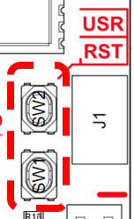

# saiot-arduino
arduino board-package targeting Santagostino IoT devices

# Changelog
* v0.0.4: first official stable-release

# Prerequisite
* Santagotino IoT Boards
* Arduino 2.X IDE
# Installation
1. Open Arduino 2.X IDE
2. Open the menu File->Preferences
3. Copy the following link in "Additional boards manager URLs": https://raw.githubusercontent.com/AL2TECH/saiot-arduino/main/package_saiot_arduino_index.json

4. Open the Boards Manager: Tools->Board->Board Manager.
5. Search for "santagostino" board package and install the latest available version.

6. If installation has been successful, a new board package selection (i.e., SANTAGOSTINO IOT Boards) and a list of related boards (e.g., HPM (Heat Pump Monitor)) should appear in Tools->Board. Choose the proper target board when developing.

# Board setup/configuration
1. When the board is powered up for the first time o when has been flashed with low power mode enabled (details in dedicated section), the board must be forced to go into boot mode: 
    1. Press and hold both reset and user button.

    

    2. Release the reset button.
    3. Release the user button.
    4. Now the boards should appear as COM device.
2. In Tools->"USB CDC On Boot" always set to Enabled: it redirects serial to USB.

3. Choose the right COM port.

# API Documentation 
* Library version: 0.0.4
* This section describes the available methods and public variables in SAIOT_Board class.
## Function
### begin(ssid, pwd, time_offset_sec)
Initializes the board by setting wifi ssid, wifi password, testing the connection and set the correct time using NTP (Network Time Protocol-Unix Epoch: seconds elapsed since 00:00:00 UTC). Attention: If you have set a time offset this time offset will be added to your epoch timestamp.

